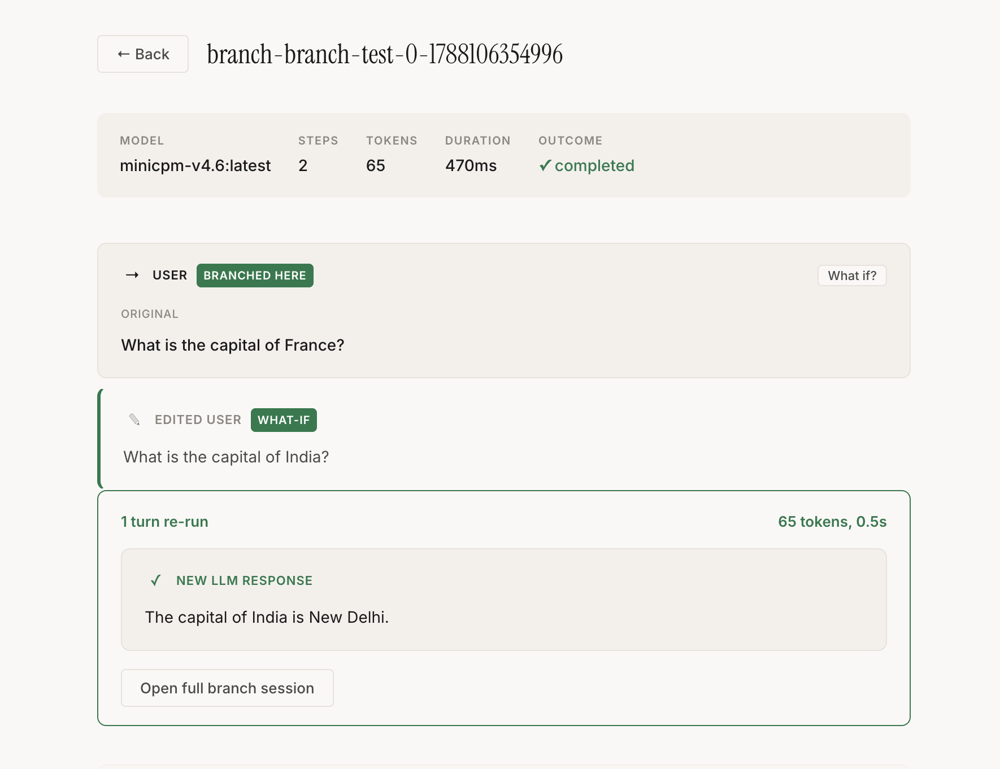
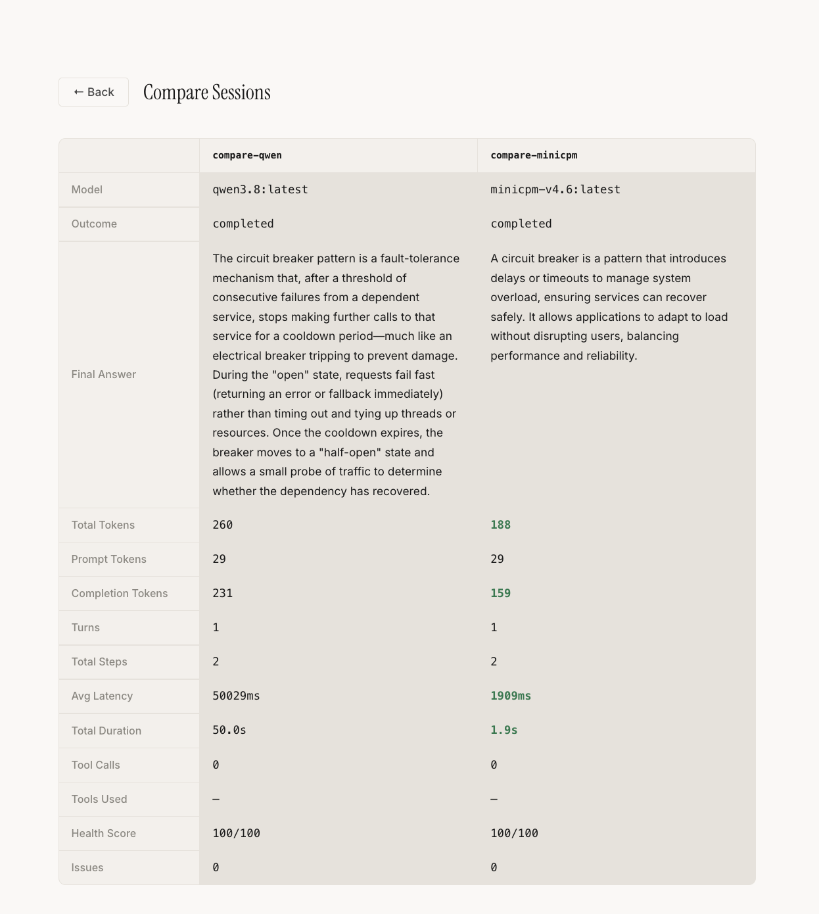

# llm-replay

Agent Session Inspector — see what your AI agent did, catch what went wrong, automatically.

A transparent HTTP proxy that captures AI agent sessions, shows you the full decision flow in real-time, and flags issues automatically.

```
Any AI Agent (Python/JS/Go/anything) → proxy (:11435) → LLM Provider
                                            ↓
                            Dashboard (:3001)
                            ├─ Live event stream
                            ├─ Issue detection
                            ├─ "What if?" branching
                            └─ Session comparison
```

No SDK. No code changes. One URL change.

## Quick Start

```bash
git clone https://github.com/Suryodaya27/llm-replay
cd llm-replay

# Install and build backend
npm install
npm run build

# Install and build dashboard
cd playground && npm install && npm run build && cd ..

# Start everything
node dist/cli.js ui
```

Open http://localhost:3001 — dashboard, API, and WebSocket all on one port.

```bash
# Name your session
node dist/cli.js ui --session my-experiment

# For slow local models, disable the request timeout
node dist/cli.js ui --session my-experiment --timeout 0

# Run any agent against the proxy (separate terminal)
curl http://localhost:11435/api/chat -d '{
  "model": "llama3",
  "messages": [{"role": "user", "content": "What is 2+2?"}],
  "stream": false
}'
```

The **Live** tab shows events streaming in real-time. The **Sessions** tab shows recorded sessions with issue detection.

## What it captures

Every LLM interaction is recorded with full fidelity:
- **Requests and responses** — complete message history, model parameters
- **Tool/function calls** — name, arguments, and results for each invocation
- **Streaming chunks** — individual tokens as they arrive, assembled into full responses
- **Token usage and latency** — per-turn metrics across all providers
- **Vision/image inputs** — images from Ollama, OpenAI, and Anthropic formats rendered inline in the dashboard

## What it catches

The proxy doesn't just record — it analyzes. After each session:

```
⚠️ 2 issues detected                              Health: 50/100

● Agent called "calculate({"query":"GDP / GDP"})" 9 times with
  identical args — stuck in a loop

▲ Tool returned an error at step 4 but agent didn't acknowledge
  it in the next response
```

- **Loops** — same tool called with same args repeatedly
- **Empty tool args** — model failed to pass required parameters
- **Ignored errors** — tool returned an error, agent continued as if nothing happened
- **Token waste** — duplicate reasoning steps
- **No final answer** — agent hit max iterations without completing

## "What if?" Branching

Edit any step in a recorded session and re-run from that point with the real LLM.

```
Original:  User: "Capital of France?" → LLM: "Paris"
                     ↓ edit to "Capital of India?"
Branch:    User: "Capital of India?" → LLM: "New Delhi"
```

Works on every step type: user messages, LLM responses, tool calls, tool results. For multi-turn sessions with tool calls, the branch loops automatically — if the LLM makes tool calls, recorded tool results from the original session are fed back, and the LLM continues until it reaches a final answer.

Click **"What if?"** on any step in the session inspector to try it.

## Usage with OpenAI / Anthropic

The proxy auto-routes by model name: `gpt-*` → OpenAI, `claude-*` → Anthropic, everything else → Ollama.

**OpenAI:**

```bash
export OPENAI_API_KEY=sk-...
node dist/cli.js ui --session openai-test
```

```python
# Python — one line change
from openai import OpenAI
client = OpenAI(base_url="http://localhost:11435/v1")
```

```typescript
// Node.js — one line change
const client = new OpenAI({ baseURL: 'http://localhost:11435/v1' });
```

**Anthropic:**

```bash
export ANTHROPIC_API_KEY=sk-ant-...
node dist/cli.js ui --session claude-test
```

```python
import anthropic
client = anthropic.Anthropic(base_url="http://localhost:11435")
```

## Features

| Feature | What |
|---|---|
| **Live Dashboard** | Watch agent events stream in real-time via WebSocket |
| **Issue Detection** | Automatically flags loops, errors, token waste |
| **What-if Branching** | Edit any step and re-run from that point with the real LLM |
| **Circuit Breaker** | Fast failure when LLM providers are down, auto-recovery |
| **Session Inspector** | Readable conversation flow with expandable tool I/O |
| **Multi-Provider** | Routes to Ollama, OpenAI, Anthropic by model name |
| **Token Tracking** | Tokens + latency per step, automatic (all providers) |
| **Session Compare** | Side-by-side summary: tokens, latency, health, outcome |
| **CI Assertions** | `test --assert "contains:X"` — exit 0/1 |
| **Replay** | Serve recorded LLM responses for deterministic agent testing |
| **Named Sessions** | `ui --session my-run` for organized capture |
| **No-Timeout Mode** | `--timeout 0` for slow local models — no circuit breaker trips |
| **Vision Support** | Images from Ollama/OpenAI/Anthropic rendered inline in the dashboard |

## Screenshots

| Screenshot | Description |
|---|---|
|  | Session inspector showing detected errors and issue analysis |
|  | What-if branching — edit a step and see the new LLM response |
|  | Side-by-side session comparison: tokens, latency, health |
|  | Live tab showing real-time WebSocket event output |
|  | Sessions tab listing all captured agent sessions |

## Example: Code Review Agent

The `examples/code-review-agent/` directory contains a multi-step tool-calling agent that reviews code diffs. It runs through the llm-replay proxy, so you can inspect, replay, and debug the full agent session.

```bash
# Terminal 1: start llm-replay
node dist/cli.js ui --session code-review

# Terminal 2: run the agent
cd examples/code-review-agent && npm install
npm run review -- --ref main --model gemma4:cloud --verbose
```

The agent calls `get_git_diff`, `read_file`, `search_code`, and more — typically 10-20 tool calls per review. Open http://localhost:3001 to watch it work in real-time.

See [examples/code-review-agent/README.md](examples/code-review-agent/README.md) for full usage.

## Requirements

- Node.js >= 20
- [Ollama](https://ollama.com) running locally (for local models)
- OpenAI/Anthropic API keys (optional, set as env vars)

## CLI Commands

| Command | Description |
|---------|-------------|
| `ui` | Start everything (API + proxy + dashboard on one port) |
| `ui --session <name>` | Start with a named session |
| `ui --timeout <ms>` | Set request timeout (0 = no timeout, default) |
| `capture --session <id>` | Start capture proxy only |
| `replay --session <id>` | Serve recorded responses (for testing without LLM) |
| `stats --session <id>` | Token/latency breakdown |
| `test --session <id>` | CI assertions against sessions |
| `ls` | List sessions |
| `inspect --session <id>` | View raw events |
| `rm --session <id>` | Delete session |

## Architecture

```
┌─────────────────────────────────────────────────┐
│           Dashboard (:3001)                     │
│  Live Tab │ Sessions Tab │ What-if Branching    │
├─────────────────────────────────────────────────┤
│           API Server (:3001)                    │
│  /ws │ /api/sessions │ /api/branch │ /api/compare │
│  Static files (playground/dist)                 │
└───────────────────────┬─────────────────────────┘
                        │
┌───────────────────────▼─────────────────────────┐
│           Capture Proxy (:11435)                │
│                                                 │
│  ┌─────────────────┐  ┌──────────────────────┐ │
│  │ Circuit Breaker  │  │  Provider Router     │ │
│  │ (fast failure)   │  │  (Ollama/OpenAI/...) │ │
│  └─────────────────┘  └──────────────────────┘ │
│                                                 │
│  ┌─────────────────┐  ┌──────────────────────┐ │
│  │ Event Store      │  │  Response Format     │ │
│  │ (JSONL + WS)     │  │  (factory parser)    │ │
│  └─────────────────┘  └──────────────────────┘ │
└─────────────────────────────────────────────────┘
```

## Project Structure

```
src/
  index.ts              # Public API barrel
  types.ts              # Shared event types (discriminated union)
  cli.ts                # CLI entry point

  core/                 # Engine
    event-store.ts      # Append-only JSONL persistence
    capture.ts          # HTTP traffic recording
    replay.ts           # Serve recorded responses
    branch.ts           # What-if branching (edit + re-run)
    clock.ts            # Real + virtual clocks
    circuit-breaker.ts  # Resilience state machine

  server/               # HTTP layer
    proxy.ts            # Multi-provider proxy server
    api-server.ts       # REST API + static file serving
    live-broadcast.ts   # WebSocket event broadcasting

  analysis/             # Event analysis
    conversation-parser.ts  # Raw events → conversation timeline
    issue-detector.ts       # Automatic issue detection + scoring
    stats.ts                # Token/latency statistics
    test-runner.ts          # CI assertion runner

  providers/            # LLM provider adapters
    response-format.ts  # Unified response parsing (factory pattern)
    router.ts           # Model name → provider routing
    ollama.ts / openai.ts / anthropic.ts

  __tests__/            # Unit + integration tests

examples/
  code-review-agent/    # Multi-step tool-calling agent (demo + stress test)
```

## Design Patterns

| Pattern | Where | Why |
|---|---|---|
| **Circuit Breaker** | `core/circuit-breaker.ts` | State machine prevents cascading failures when providers go down |
| **Factory** | `providers/response-format.ts` | Detects provider format by response shape, extracts content/tokens/tools uniformly |
| **Strategy** | Provider adapters | Each provider implements same interface, proxy swaps at runtime |
| **Observer** | `store.onEvent` callback | Decouples recording from broadcasting |
| **Discriminated Union** | Event types | TypeScript narrows event shape by `type` field at compile time |
| **Async Generator** | `store.read()` | Streams events without loading entire session into memory |

## Testing

```bash
npm test    # 58 tests across 5 files
```

Covers: event store persistence, capture/replay loop (integration), circuit breaker state machine, issue detector heuristics, response format parsing for all providers.

## License

MIT
