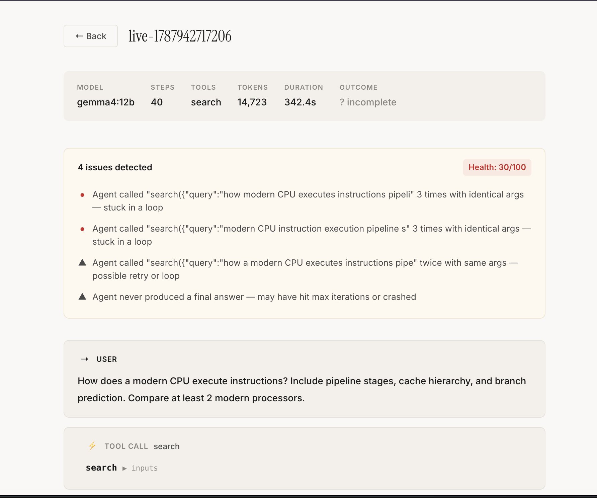
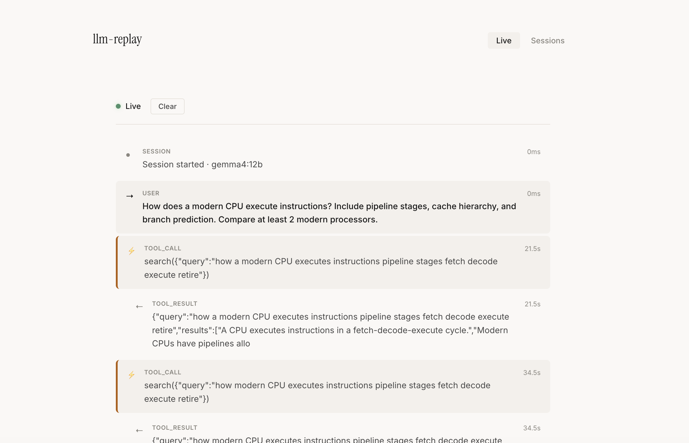
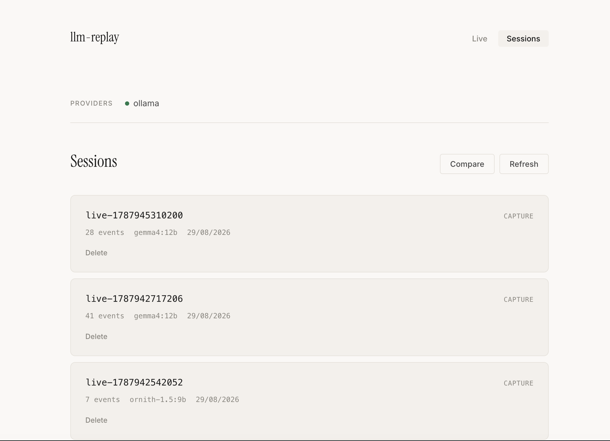

# llm-replay (agentlens)

## Highlights

- **Situation:** AI agents make multi-step decisions across LLM calls and tool invocations, but when they fail there's no way to see which step went wrong without manually reading logs.
- **Task:** Built a language-agnostic proxy layer that captures, visualizes, and analyzes AI agent sessions in real-time — without requiring any SDK integration or code changes in the agent.
- **Action:** Designed a transparent HTTP proxy with circuit breaker pattern for resilience, WebSocket-based live event streaming, a conversation parser that extracts structured tool calls from raw HTTP (supporting OpenAI, Anthropic, and Ollama formats), and a post-session issue detector that automatically flags loops, ignored errors, and token waste.
- **Result:** Any AI agent (Python, JS, Go, Rust — any language) can be inspected by changing one URL. The system detects stuck loops, failed tool calls, and wasted tokens automatically, reducing agent debugging time from hours of trace-reading to a single glance at the dashboard.

---

Agent Session Inspector — see what your AI agent did, catch what went wrong, automatically.

## What it does

A transparent HTTP proxy that captures AI agent sessions, shows you the full decision flow in real-time, and flags issues automatically.

```
Any AI Agent (Python/JS/Go/anything) → proxy (:11435) → LLM Provider
                                            ↓
                              Live Dashboard + Issue Detection
```

No SDK. No code changes. One URL change.

## What it catches

The proxy doesn't just record — it analyzes. After each session:

```
⚠️ 2 issues detected                              Health: 50/100

● Agent called "calculate({"query":"GDP / GDP"})" 9 times with
  identical args — stuck in a loop

▲ Tool returned an error at step 4 but agent didn't acknowledge
  it in the next response
```

Issue types detected:
- **Loops** — same tool called with same args repeatedly (agent is stuck)
- **Empty tool args** — model failed to pass required parameters
- **Ignored errors** — tool returned an error, agent continued as if nothing happened
- **Token waste** — duplicate reasoning steps
- **No final answer** — agent hit max iterations without completing

## Circuit Breaker

The proxy protects your agent from hanging when LLM providers go down:

```
Provider healthy:    Agent → Proxy → Ollama → response (normal)
Provider down:       Agent → Proxy → 503 instant (no 5-minute hang)
Provider recovered:  Agent → Proxy → Ollama → response (auto-recovery)
```

Three states: CLOSED (normal) → OPEN (failing fast) → HALF_OPEN (probing recovery).

If Ollama crashes or takes too long, your agent gets an instant 503 with `retry-after` header instead of waiting forever. The proxy auto-recovers when the provider comes back.

## Quick Start

**Start everything:**

```bash
npm run build
node dist/cli.js ui
```

**Open dashboard:**

```bash
cd playground && npm run dev
# Open http://localhost:5173
```

**Run any agent (separate terminal):**

```bash
# Your agent points at localhost:11435
MODEL=minicpm-v4.6:latest npx tsx my-agent.ts --proxy
```

The **Live** tab shows events streaming in real-time. The **Sessions** tab shows recorded sessions with issue detection.

## Features

| Feature | What |
|---|---|
| **Live Dashboard** | Watch agent events stream in real-time via WebSocket |
| **Issue Detection** | Automatically flags loops, errors, token waste |
| **Circuit Breaker** | Fast failure when LLM providers are down, auto-recovery |
| **Session Inspector** | Readable conversation flow with expandable tool I/O |
| **Multi-Provider** | Routes to Ollama, OpenAI, Anthropic by model name |
| **Token Tracking** | Tokens + latency per step, automatic |
| **CI Assertions** | `test --assert "contains:X"` — exit 0/1 |
| **Language Agnostic** | Works with any language via HTTP |

## Screenshots

| Screenshot | Description |
|---|---|
|  | Session inspector showing detected errors and issue analysis |
|  | Live tab showing real-time WebSocket event output |
|  | Sessions tab listing all captured agent sessions |

## Requirements

- Node.js >= 20
- [Ollama](https://ollama.com) running locally (for local models)
- OpenAI/Anthropic API keys (optional)

## Install

```bash
git clone <repo-url>
cd llm-replay
npm install
npm run build
npm link  # optional: global command
```

## CLI Commands

| Command | Description |
|---------|-------------|
| `ui` | Start everything (API + proxy + WebSocket + live dashboard) |
| `capture` | Start capture proxy only |
| `replay` | Serve recorded responses (for testing agent code) |
| `stats` | Token/latency breakdown |
| `test` | CI assertions against sessions |
| `judge` | AI-score comparison between two sessions |
| `ls` | List sessions |
| `inspect` | View raw events |
| `rm` | Delete session |

## Architecture

```
┌─────────────────────────────────────────────────┐
│           Live Dashboard (:5173)                │
│     Live Tab (WebSocket) │ Sessions Tab         │
└───────────────────────┬─────────────────────────┘
                        │ WebSocket + REST
┌───────────────────────▼─────────────────────────┐
│           API Server (:3001)                    │
│  /ws │ /api/sessions │ /api/conversation        │
└───────────────────────┬─────────────────────────┘
                        │
┌───────────────────────▼─────────────────────────┐
│           Capture Proxy (:11435)                │
│                                                 │
│  ┌─────────────────┐  ┌──────────────────────┐ │
│  │ Circuit Breaker  │  │  Provider Router     │ │
│  │ (fast failure)   │  │  (Ollama/OpenAI/...) │ │
│  └─────────────────┘  └──────────────────────┘ │
│                                                 │
│  ┌─────────────────┐  ┌──────────────────────┐ │
│  │ Event Store      │  │  Issue Detector      │ │
│  │ (JSONL + WS)     │  │  (post-session)      │ │
│  └─────────────────┘  └──────────────────────┘ │
└─────────────────────────────────────────────────┘
```

## Design Patterns Used

| Pattern | Where | Why |
|---|---|---|
| **Circuit Breaker** | `circuit-breaker.ts` | State machine (closed/open/half_open) prevents cascading failures when providers go down |
| **Template Method** | `circuitBreaker.execute(fn)` | Breaker controls lifecycle, caller provides the operation |
| **Sliding Window** | Failure counting | Only recent failures count — prevents a single blip from breaking everything |
| **Strategy** | Provider adapters | Each provider (Ollama/OpenAI/Anthropic) implements same interface, proxy swaps at runtime |
| **Observer** | `store.onEvent` callback | Decouples recording from broadcasting — proxy doesn't know about WebSocket |
| **Discriminated Union** | Event types | TypeScript narrows event shape by `type` field at compile time |
| **Iterator (Async Generator)** | `store.read()` | Streams events without loading entire session into memory |

## Project Structure

```
llm-replay/
├── src/
│   ├── proxy.ts               # Capture proxy + circuit breaker
│   ├── circuit-breaker.ts     # Resilience: fast failure + auto-recovery
│   ├── issue-detector.ts      # Post-session analysis (loops, errors, waste)
│   ├── conversation-parser.ts # Extracts tool calls from raw HTTP
│   ├── live-broadcast.ts      # WebSocket event broadcasting
│   ├── api-server.ts          # REST API + WebSocket server
│   ├── event-store.ts         # JSONL persistence with live listener
│   ├── capture.ts             # HTTP interception + recording
│   ├── replay.ts              # Cached response serving
│   ├── stats.ts               # Token/latency extraction
│   ├── test-runner.ts         # CI assertion engine
│   ├── judge.ts               # LLM-as-a-judge scoring
│   ├── clock.ts               # Real + Virtual clock
│   ├── cli.ts                 # All CLI commands
│   ├── types.ts               # Event types
│   ├── index.ts               # Public API
│   └── providers/
│       ├── ollama.ts          # Ollama adapter
│       ├── openai.ts          # OpenAI adapter
│       ├── anthropic.ts       # Anthropic adapter
│       ├── router.ts          # Model → provider routing
│       └── types.ts           # Provider interface
├── playground/                # React web UI
│   └── src/
│       ├── App.tsx            # Live + Sessions tabs
│       └── components/
│           ├── LiveView.tsx         # Real-time event stream
│           ├── ConversationView.tsx # Session inspector + issues
│           ├── SessionList.tsx      # Session browser
│           └── DiffView.tsx         # Side-by-side comparison
├── package.json
└── tsconfig.json
```

## Tests

```bash
npm test  # 7 tests (unit + integration)
```

## License

MIT
